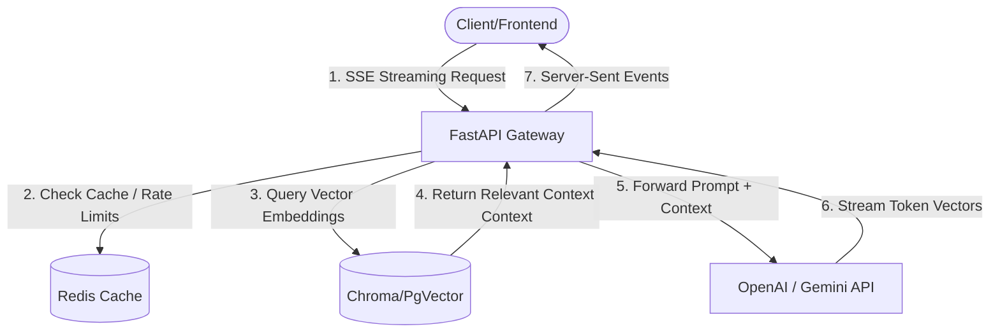

# rajsingh
Config files for my GitHub profile.
Here is a comprehensive, production-ready project `README.md` template designed explicitly for a **FastAPI backend hosting an LLM-powered RAG (Retrieval-Augmented Generation) Chatbot**.

It features an embedded **Mermaid.js architecture diagram** (which GitHub renders natively into a visual flowchart) along with clean sections for API routing, environment configuration, and installation.

---

### The Repository README Template

Copy the raw Markdown code fence below and drop it into the root directory of your project repository as `README.md`:

```markdown
# 🤖 Enterprise RAG Chatbot Service

A production-grade asynchronous backend service built with **FastAPI** that powers an intelligent conversational agent. The application implements a **Retrieval-Augmented Generation (RAG)** pipeline using LangChain, processing internal enterprise documents via a vector database to provide context-aware, low-latency responses while strictly preventing model hallucinations.

---

## 🏗️ System Architecture

This service uses a decoupled architecture to manage incoming chat streams, context retrieval, and heavy embeddings tasks without blocking the main event loop.



---

## 🛠️ Tech Stack & Dependencies

* **Framework:** FastAPI (Asynchronous Python Web Framework)
* **Orchestration & Chains:** LangChain / LangGraph
* **Vector Database:** ChromaDB (Local testing) / PgVector (Production scaling)
* **LLM Integration:** OpenAI GPT-4o / Google Gemini API via Instructor
* **Caching & Session Management:** Redis (In-memory datastore)
* **Containerization:** Docker & Docker Compose

---

## 🚦 Core API Endpoints

| Method | Endpoint | Description | Auth Required? |
| --- | --- | --- | --- |
| `POST` | `/api/v1/chat/stream` | Streams chatbot answers token-by-token via Server-Sent Events (SSE). | Yes |
| `POST` | `/api/v1/documents/upload` | Ingests `.pdf`/`.md` files, chunks them, and embeds them into the vector database. | Yes (Admin) |
| `GET` | `/api/v1/chat/history/{session_id}` | Fetches past messaging sessions cached inside Redis. | Yes |
| `GET` | `/health` | Liveness and readiness probe for Kubernetes/Cloud monitoring. | No |

---

## ⚙️ Environment Configuration

Create a `.env` file in the project root directory and populate it with the following configuration keys:

```ini
# Server Setup
APP_ENV=development
PORT=8000
SECRET_KEY=your_super_secret_jwt_signing_key

# Third-Party AI Engine Credentials
OPENAI_API_KEY=sk-proj-...
GEMINI_API_KEY=AIzaSy...

# Database Infrastructures
REDIS_URL=redis://localhost:6379/0
VECTOR_DB_PATH=./data/vector_store

```

---

## 🚀 Local Installation & Setup

Ensure you have **Python 3.10+** and **Docker** installed on your workstation.

### 1. Clone the Workspace

```bash
git clone [https://github.com/YOUR_USERNAME/YOUR_REPO_NAME.git](https://github.com/YOUR_USERNAME/YOUR_REPO_NAME.git)
cd YOUR_REPO_NAME

```

### 2. Stand up Infrastructure Services via Docker

Spin up your background state handlers (Redis, VectorDB engines) cleanly in detached mode:

```bash
docker-compose up -d

```

### 3. Initialize Your Python Native Virtual Environment

```bash
python3 -m venv venv
source venv/bin/activate  # On Windows use: venv\Scripts\activate
pip install --upgrade pip
pip install -r requirements.txt

```

### 4. Run the Engine Development Server

```bash
uvicorn app.main:app --reload --host 0.0.0.0 --port 8000

```

Once ignited, you can view the live interactive API documentation page (Swagger UI) at: **`http://localhost:8000/docs`**

---

## 🔒 Production Security Protocols

* **CORS Configuration:** Strictly locked down to recognized frontend client origins via FastAPI `CORSMiddleware`.
* **Rate-Limiting:** Integrated sliding-window algorithm limits via Redis to defend compute vectors against denial-of-service queries.

```

---

### Why this structure makes you look elite to recruiters:
1. **The Architecture Blocks:** Most junior developers simply write code. Showing a **system flowchart** proves you think about how components talk over network layers (databases, servers, caches).
2. **Clear Routing Table:** Laying out the endpoints cleanly shows you understand API contract designs.
3. **Infrastructure Isolation:** Including steps for `docker-compose` and `.env` setups lets engineering leads know that your project can run flawlessly outside of your personal machine.

```
